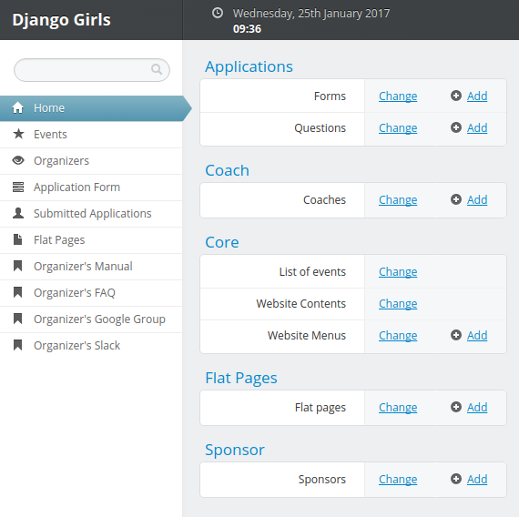

# Administrando o site do seu evento

Django Girls construiram uma aplicação em Django que permite que você crie o site do seu evento de uma forma bem simples. Você não precisa saber programar para alterar ele, mas saber um pouquinho de HTML e CSS já ajuda :).

O site será criado depois que você submeter uma [requisição](https://djangogirls.org/organize/) para organizar um evento e confirmar que leu esse manual ;). Não esqueça de mandar o nome e email dos outros membros do seu time. 

Todo o seu time irá ter acesso ao painel de administração do Django. Ele é assim: 

No menu esquerdo, você encontrará tudo o que precisa para adminsitrar seu site, e também links pro manual da organização, Slack e Google Group.

Mesmo se você tiver familiaridade com a interface de admin do Django, recomendo fortemente que leia esse capítulo. 

# O que fazer se algo não estiver funcionando?

Primeiro, pode dar uma lida na nossa [FAQ](https://faq-organizers.djangogirls.org/) para ver se a sua pergunta já foi respondida ali. Se não, tente contatar outros organizadores no [Slack](https://djangogirls.slack.com/) ou [Google Groups](https://groups.google.com/forum/#!forum/django-girls-organizers): eles ficarão felizes em ajudar! Se você ainda não conseguir resolver o problema, entre em contato com o [Time de Suporte](mailto:hello@djangogirls.org).

# Tabela de conteúdos desse capítulo:

- [Editar informações básicas](./info_basica.md)
- [Editar conteúdo do site](./conteudo.md)
- [Adicionar patrocinadores](./patrocinadores.md)
- [Adicionar treinadores](./treinadores.md)
- [Adicionar uma lista de emails](./lista_email.md)
- [Quando estiver pronto](./quando_pronto.md)