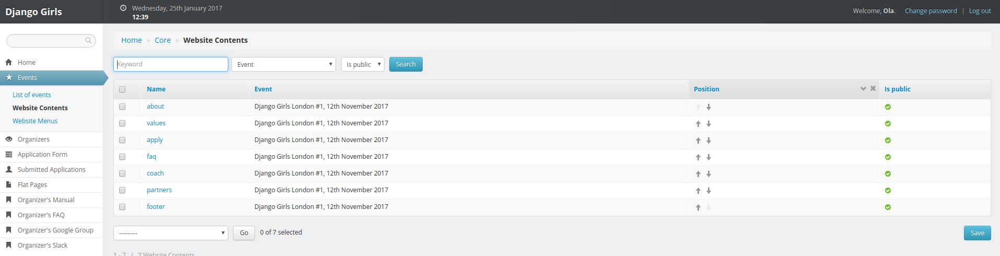
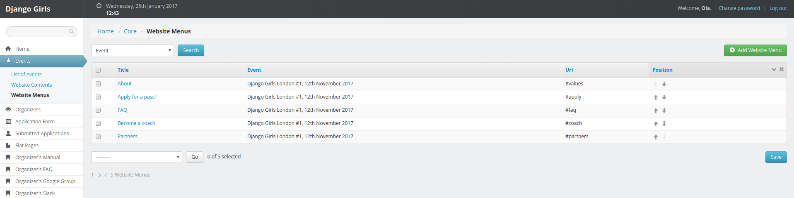

# Gestão do conteúdo

## A estrutura do seu site

### Seções do site 

Ao clicar em `Events (Eventos)` e `Website Contents (Conteúdos do Site)`, você ve essa página:

Essa página é uma lista de seções padrão que você pode ajustar de acordo com suas necessidades:

* `about (sobre)`: um slogan pro seu evento.
* `values (valores)`: uma descrição geral pro seu evento.
* `apply (inscrição)`: um link para o formulário de inscrição para participantes.
* `faq`: perguntas frequentes que os participantes fazem.
* `coach (treinadores)`: informações para possíveis pessoas trienadoras e o link para o formulário de inscrição de pessoas treinadoras.
* `partners (parceiros)`: lista de patrocinadores.
* `footer (rodapé)`: links pras mídias sociais.

Você pode reordenar essas seções usando as setas na coluna de  `position (posição)`. Não esqueça de salvar suas modificações clicando no botão `Save (Salvar)` na parte de baixo da página. 

Para filtrar as seções conectadas a um evento específico: 
* Clique em `Page (Página)` no menu de seleção.
* Clique no evento que está organizando.
* Clique no botão de `Search (Busca)`.

:tada:

### Menu do site

Ao clicar em `Events (Eventos)` e `Website Menus (Menus do Site)`, você chega nessa página:

Essa tabela é o menu que você vê no topo do seu site: todas entradas são conectados com a seção de `Website Content (Conteúdo do Site)`

Você pode reordenar o menu usando as setas para cima e para baixo na coluna de `Position (Posição)` e clicando no botão `Save (Salvar)` na parte de baixo da página.

Ao clicar em um item no menu, você pode modificar o título e a URL. A estrutura do seu site já está configurada: você não precisa mudar essas configurações. 

Para filtrar o menu conectado a um evento específico:
* Clique em `Page (Página)` no menu de seleção.
* Clique no evento que está organizando.
* Clique no botão de `Search (Busca)`.

## Editar o conteúdo do site:

Para alterar o conteúdo do seu site:

* Clique em `Events (Eventos)` no menu esquerdo.
* Vá para `Conteúdos do Site`.
* Clique no nome da seção que quer modificar.
* Edite o html no campo `Content (Conteúdo)`. Se o editor de código for muito pequeno, você pode adaptar o tamanho clicando e arrastando o botão no canto direito inferior. Não esqueça de verificar se todas as tags htmls estão fechadas ;) 
* Salve suas modificações clicando no botão azul `save (salvar)` no menu direito.

:tada:

Uma vez que seu evento tenha sido realizado, você não poderá editar esses campos. Se precisar fazer isso, nos envie um [email](mailto:hello@djangogirls.com).