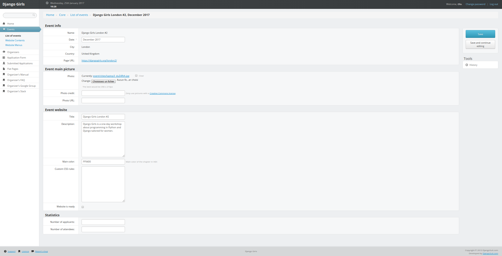

# Como alterar informações básicas do seu evento

## Alterar informações no site

Para alterar informações básicas sobre seu evento no site:
* Clique em `Events (eventos)` no menu esquerdo.
* Clique no site do seu evento na tabela. Você vai ver uma página assim:

### `Event Info (Informações do Evento)`:

* `Name (Nome)`, `City (Cidade)`, `Country(País)`, `Page URL(URL da página)`: É o nome do seu evento, onde vai acontecer e o endereço do seu site. Você não pode editar essas informações: se precisar fazer isso, entre em [contato](mailto:hello@djangogirls.com).
* `Date(Data)`: Você pode editar esse campo se precisar trocar a data do evento. Se precisar cancelar o workshop, nos avise ;)

### `Event main picture (Imagem principal do evento)`:

`Photo (Imagem)`, `Photo credit (Créditos da imagem)`, `Photo link(Link da imagem)`:
Esses campos são conectados com a imagem de capa do seu evento na [página de eventos](https://djangogirls.org/events/) do site do Django Girls. Nós já lhe demos um então não precisa editar esses campos. Se precisar alterar, use só imagens com a licença de Creative Common e não esqueça de atualizar os créditos e o link.

### `Event website (site do evento)`:

* `Title (Título)`: Esse é o nome do site do evento.
* `Description (Descrição)`: Você pode editar ou traduzir esse campo.
* `Main color (cor principal)`: Não gosta de laranja? Escolha outra cor pro seu site e insira aqui com formato "hex". Escolha uma cor em que o texto fique legível! 
* `Custom css (css personalizado)`: coloque css extra aqui. 
* `Website is ready (Site está pronto)`: Quando você acabar de editar o conteúdo do seu site e quiser colocar no ar, marque essa caixa e clique em `Save (Salvar)` no menu direito. Lembre-se que você não precisa fazer isso pra testar seu site: sempre vai estar no ar para você e seu time. 

Não esqueça de salvar qualquer modificação clicando no botão `Save (Salvar)` no menu direito.

Quando seu evento já tiver acontecido, você não vai poder editar esses campos. Se precisar fazer isso, nos mande um [email](mailto:hello@djangogirls.com)

### `Statistics (Estatísticas)`:

`Number of applicants (Número de inscrições)` e `Number of attendees (Número de participantes)`: depois que seu evento tiver acontecido, não esqueça de preencher esses campos. Isso ajuda a gente a saber quantas pessoas estão participando do workshop :) 

Não esqueça de salvar qualquer modificação clicando no botão `Save (Salvar)` no menu direito.

##  Adicionar ou remover organizadores do seu time 

### Para adicionar mais pessoas na organização

Na página de admin:

* Clique em `Organizers (Organizadores)` no menu esquerdo ou [entre aqui](https://djangogirls.org/admin/core/event/add_organizers/).
* Selecione seu evento na lista.
* Adicione o nome completo da pessoa nova na organização.
* Adicione o endereço de email dessa pessoa.
* Clique no botão `Add organizer (Adicionar organizador)`.

Refaça esses passos para cada pessoa que queira adicionar na organização.

### Para remover pessoas da organização

Na página de admin:

* Clique em `Organizers (Organizadores)` no menu esquerdo ou [entre aqui](https://djangogirls.org/admin/core/event/add_organizers/).
* Selecione seu evento na lista.
* Clique em `Remove (Remover)` ao lado da pessoa que deseja remover.
* Confirme que quer remover essa pessoa.

Refaça esses passos para cada pessoa que queira remover.